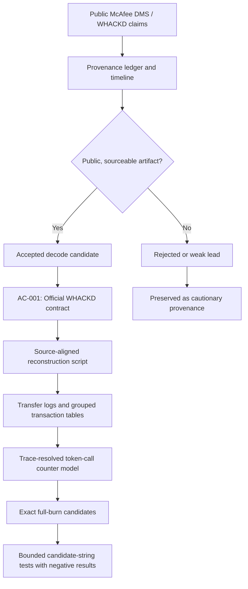
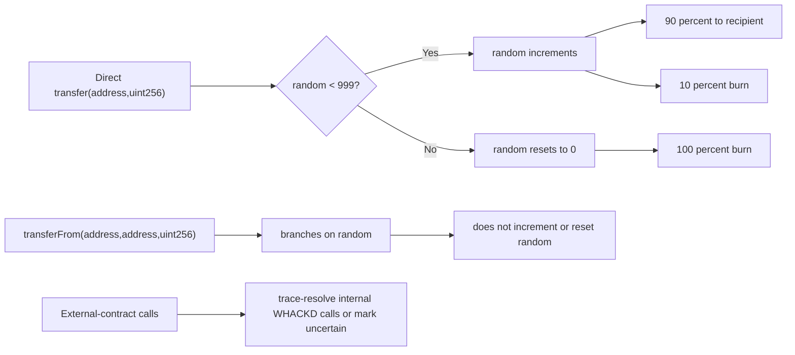

# WackDecode

Public-source firewalking through the John McAfee dead-man-switch rumor machine, the WHACKD token, and the wreckage field of screenshots, countdowns, copycats, and bad magic.

This repository does **not** claim that a McAfee-controlled dead man switch has been proven. It does something more useful: it drags every claim under fluorescent light, checks the timestamps, separates real artifacts from theatrical smoke, and leaves a reproducible trail for anyone brave enough to keep digging.

No private data. No breached material. No vigilante cosplay. Public sources, public chains, public archives, sober confidence ratings.

## What Has Been Found So Far

The investigation has moved from rumor triage into reproducible artifact work. The strongest current result is not a decoded dead-man-switch payload. It is a bounded, public, on-chain reconstruction path for the official WHACKD contract.

| Finding | Current status | Where to verify |
|---|---|---|
| McAfee made public DMS-style claims | Supported by public reporting and preserved in the source ledger. | [`sources.csv`](mcafee-dms-provenance/sources.csv), [`confidence_ranked_timeline.md`](mcafee-dms-provenance/confidence_ranked_timeline.md) |
| Official WHACKD contract identity | High confidence. The accepted contract is `0xCF8335727B776d190f9D15a54E6B9B9348439eEE`; creation transaction is `0x1bb323576cd7dcb12e9f8507a5e298a0136927a486f959e3984cb7cca21ed96b`. | [`decode_candidates.md`](mcafee-dms-provenance/decode_candidates.md), [`mcafee-dms-report-and-decoding-plan.md`](reports/mcafee-dms-report-and-decoding-plan.md) |
| WHACKD source-aligned burn behavior | Token-level `transfer` calls mutate the `random` counter; `transferFrom` reads the counter but does not increment or reset it. External rows are trace-resolved when RPC support exists. | [`option2_whackd_reconstruction_notes.md`](mcafee-dms-provenance/option2_whackd_reconstruction_notes.md), [`whackd_reconstruction.py`](mcafee-dms-provenance/whackd_reconstruction.py) |
| Exact full-burn candidates | The `8950000` sweep finds `5` exact rows at token transfer ordinals `1000`, `2000`, `3000`, `4000`, and `5000`. | [`option2-data-8950000/full_burn_candidates.csv`](mcafee-dms-provenance/option2-data-8950000/full_burn_candidates.csv) |
| DMS payload, release key, or McAfee-controlled trigger | Not proven. No current result authenticates a payload, key, or post-death release mechanism. | [`mcafee-dms-report-and-decoding-plan.md`](reports/mcafee-dms-report-and-decoding-plan.md), [`option2_whackd_reconstruction_notes.md`](mcafee-dms-provenance/option2_whackd_reconstruction_notes.md) |

Current reconstruction outputs:

| Run | Block range | Output folder | Result |
|---|---:|---|---|
| Smoke run | `8943162`-`8944000` | [`option2-data/`](mcafee-dms-provenance/option2-data/) | `631` Transfer logs, `316` grouped transactions, no full-burn row. |
| Larger sweep | `8943162`-`8945000` | [`option2-data-8945000/`](mcafee-dms-provenance/option2-data-8945000/) | `2,989` Transfer logs, `1,495` grouped transactions, `3` traced internal `transferFrom` calls, `1` exact full-burn candidate. |
| Extended sweep | `8943162`-`8950000` | [`option2-data-8950000/`](mcafee-dms-provenance/option2-data-8950000/) | `10,043` Transfer logs, `5,022` grouped transactions, `17` traced internal token calls, `5` exact full-burn candidates. |
| Bounded candidate screen | exact full-burn rows only | [`bounded_candidate_format_tests.csv`](mcafee-dms-provenance/option2-data-8950000/bounded_candidate_format_tests.csv) | `60` deterministic strings tested, `0` specific public-reference format matches, broad hash-shape collisions recorded as non-evidence. |





## The Short Version

McAfee made dead-man-switch-like public claims. WHACKD is a real Ethereum token. Post-death artifacts and rumors circulated. Those facts are not the same thing as proof of a functioning dead man switch.

The current assessment:

| Question | Current answer |
|---|---|
| Did McAfee make public DMS-style claims? | Yes, reported by multiple public sources. |
| Is WHACKD a real on-chain artifact? | Yes. The official contract is `0xCF8335727B776d190f9D15a54E6B9B9348439eEE`. |
| Did post-death DMS rumors circulate? | Yes. The Instagram "Q" post, Telegram/QAnon claims, and `britbonglogpost.com` countdown all belong to that ecosystem. |
| Has a McAfee-controlled operational DMS been proven? | No. Not from the evidence currently preserved here. |
| Is there still useful technical work to do? | Yes. Start with provenance, then reconstruct the official WHACKD contract behavior. |

## What Is In This Repo

| Path | Purpose |
|---|---|
| [`reports/mcafee-dms-report-and-decoding-plan.md`](reports/mcafee-dms-report-and-decoding-plan.md) | Main report: evidence summary, confidence matrix, timeline, WHACKD mechanics, and technical decoding plan. |
| [`reports/mcafee-dms-report-and-decoding-plan.html`](reports/mcafee-dms-report-and-decoding-plan.html) | Browser-readable version of the main report. |
| [`mcafee-dms-provenance/provenance-map-report.html`](mcafee-dms-provenance/provenance-map-report.html) | Provenance map report for the accepted and rejected leads. |
| [`mcafee-dms-provenance/confidence_ranked_timeline.md`](mcafee-dms-provenance/confidence_ranked_timeline.md) | Event timeline with confidence levels and source IDs. |
| [`mcafee-dms-provenance/decode_candidates.md`](mcafee-dms-provenance/decode_candidates.md) | Shortlist of public artifacts worth technical analysis. |
| [`mcafee-dms-provenance/sources.csv`](mcafee-dms-provenance/sources.csv) | Source ledger with URLs, source IDs, and provenance metadata. |
| [`mcafee-dms-provenance/evidence_graph.graphml`](mcafee-dms-provenance/evidence_graph.graphml) | GraphML evidence graph for external graph tools. |
| [`mcafee-dms-provenance/option2_whackd_reconstruction_notes.md`](mcafee-dms-provenance/option2_whackd_reconstruction_notes.md) | Current WHACKD Option 2 reconstruction notes, run commands, source alignment, and full-burn findings. |
| [`mcafee-dms-provenance/whackd_reconstruction.py`](mcafee-dms-provenance/whackd_reconstruction.py) | Reproducible script for exporting Transfer logs, grouping transactions, tracing internal calls, and reconstructing the token-call counter model. |
| [`mcafee-dms-provenance/option2-data/`](mcafee-dms-provenance/option2-data/) | Initial smoke-run output tables for blocks `8943162` through `8944000`. |
| [`mcafee-dms-provenance/option2-data-8945000/`](mcafee-dms-provenance/option2-data-8945000/) | Larger sweep output tables for blocks `8943162` through `8945000`, including the first exact full-burn candidate. |
| [`mcafee-dms-provenance/option2-data-8950000/`](mcafee-dms-provenance/option2-data-8950000/) | Extended sweep output tables for blocks `8943162` through `8950000`, including five exact full-burn candidates. |
| [`mcafee-dms-provenance/bounded_candidate_tests.py`](mcafee-dms-provenance/bounded_candidate_tests.py) | Bounded format-screen script for candidate strings derived only from exact full-burn rows. |
| [`.agents/skills/osint/`](.agents/skills/osint/) | Local OSINT skill pack used to structure public-source investigation work. |

## The Operating Principle

Every claim gets handled like a live wire:

1. Find the original public source or the earliest stable archive.
2. Record the source ID, date, artifact type, and confidence.
3. Separate primary evidence from reporting, reposts, screenshots, and inference.
4. Reject leads that depend on private data, leaked data, unverifiable screenshots, or copycat contracts.
5. Promote only public, sourceable artifacts into technical decoding.

If the chain of custody collapses, the lead goes in the trash. Not because it is boring, but because bad evidence is how nonsense puts on a lab coat.

## Accepted Decode Candidates

These are not proven payloads. They are the current public artifacts that are real enough to analyze without wasting your life in the swamp.

### AC-001: Official WHACKD Contract

- Contract: `0xCF8335727B776d190f9D15a54E6B9B9348439eEE`
- Creation transaction: `0x1bb323576cd7dcb12e9f8507a5e298a0136927a486f959e3984cb7cca21ed96b`
- Contract name reported by Etherscan: `Epstein`
- Status: high confidence for artifact identity, low confidence for any DMS payload interpretation.

Current technical progress:

- Option 2 reconstruction has started in [`whackd_reconstruction.py`](mcafee-dms-provenance/whackd_reconstruction.py), with notes in [`option2_whackd_reconstruction_notes.md`](mcafee-dms-provenance/option2_whackd_reconstruction_notes.md).
- A smoke run over blocks `8943162` through `8944000` produced `631` Transfer logs and `316` grouped transactions in [`option2-data/`](mcafee-dms-provenance/option2-data/).
- A larger sweep over blocks `8943162` through `8945000` produced `2,989` Transfer logs, `1,495` grouped transactions, `3` trace-resolved internal `transferFrom` calls, and `1` exact full-burn candidate in [`option2-data-8945000/`](mcafee-dms-provenance/option2-data-8945000/).
- An extended sweep over blocks `8943162` through `8950000` produced `10,043` Transfer logs, `5,022` grouped transactions, `17` traced internal WHACKD calls, and `5` exact full-burn candidates in [`option2-data-8950000/`](mcafee-dms-provenance/option2-data-8950000/).
- The first exact full-burn candidate is transaction `0x8be7bd5924e3393c730a8edd8dae23915896d9e1ff33cae1c3cd696bc2bd3abd` at block `8944493`, timestamp `2019-11-16 12:56:33 UTC`, token transfer ordinal `1000`, with `random_before=999` and `random_after=0`.
- A bounded candidate-string screen over the five exact rows generated `60` deterministic strings and found `0` specific public-reference format matches. Broad hash-shaped matches are recorded as non-evidence in [`bounded_candidate_format_tests.csv`](mcafee-dms-provenance/option2-data-8950000/bounded_candidate_format_tests.csv).

Next useful work: continue larger range reconstruction in bounded chunks, keep `transferFrom` separate from `transfer`, and extend candidate tests only from exact reproducible full-burn rows.

### AC-002: `britbonglogpost.com`

- Publicly circulated after McAfee's death with a countdown and WHACKD linkage.
- RDAP registration timestamp preserved in the report.
- Wayback capture preserved as a public web artifact.
- Status: high confidence that the site existed, low confidence that McAfee controlled it.

Next useful work: preserve page hashes, capture metadata, extract embedded resources, compare archive timestamps, and avoid pretending attribution has been solved.

### AC-003: McAfee DMS / WHACKD Claim Corpus

- Public reports support that McAfee made DMS-like and WHACKD-linked statements.
- Status: medium confidence for the public claim chain, low confidence for the alleged cache or release mechanism.

Next useful work: locate original post archives, preserve timestamps, and treat wording-based key theories as invalid unless they produce reproducible, non-arbitrary output.

## Rejected Or Weak Leads

| Lead | Status | Why |
|---|---|---|
| Surfside / Champlain Towers "31TB" tweet | Rejected | Identified as fabricated by fact-checking. |
| Instagram "Q" post as a DMS key | Weak | Reported as an event, but not authenticated as a trigger or key. |
| `britbonglogpost.com` as proven McAfee infrastructure | Weak | Site existence is real; McAfee control is unproven. |
| Later WHACKD-named contracts | Rejected pending provenance | Copycat risk is high. |
| Telegram-only or screenshot-only clues | Rejected | No stable public source chain. |
| Generic Swarm/IPFS/Arweave theories | Not candidates yet | Valid storage systems, but no proven pointer has been accepted. |

## How To Read The Reports

Start here:

```text
reports/mcafee-dms-report-and-decoding-plan.md
```

Then check the provenance layer:

```text
mcafee-dms-provenance/decode_candidates.md
mcafee-dms-provenance/confidence_ranked_timeline.md
mcafee-dms-provenance/sources.csv
```

Then check the current Option 2 reconstruction layer:

```text
mcafee-dms-provenance/option2_whackd_reconstruction_notes.md
mcafee-dms-provenance/whackd_reconstruction.py
mcafee-dms-provenance/option2-data/
mcafee-dms-provenance/option2-data-8945000/
mcafee-dms-provenance/option2-data-8950000/
```

If you use graph tooling, open:

```text
mcafee-dms-provenance/evidence_graph.graphml
```

The HTML reports are included so the investigation can be read without a Markdown renderer.

## Methodology

This project uses a provenance-first OSINT method:

- Public sources only.
- Source IDs for traceability.
- Confidence ratings per claim, not per vibe.
- Explicit separation between verified facts, public claims, inference, and speculation.
- Known false leads preserved so they do not keep resurrecting themselves in new clothes.
- Technical analysis only after the artifact passes basic provenance checks.

The point is not to be cynical. The point is to be unfooled.

## Legal And Ethical Boundary

This repo is for lawful public-source research and technical analysis of public artifacts.

Do not use it to:

- identify private people behind wallets without a strong public-interest basis;
- buy, request, or distribute leaked data;
- access private systems;
- harass people;
- launder rumor into accusation;
- pretend a coincidence is a cryptographic proof.

The conspiracy-industrial complex wants your attention. Evidence wants your discipline.

## Current Technical Progress

The defensible next phase, WHACKD blockchain reconstruction, is now underway. The current reproducible artifacts are:

- [`option2_whackd_reconstruction_notes.md`](mcafee-dms-provenance/option2_whackd_reconstruction_notes.md): run notes, source alignment, classification rules, and current findings.
- [`whackd_reconstruction.py`](mcafee-dms-provenance/whackd_reconstruction.py): script for fetching Transfer logs, grouping transactions, tracing internal token calls, classifying burn behavior, and modeling the token-call counter.
- [`bounded_candidate_tests.py`](mcafee-dms-provenance/bounded_candidate_tests.py): script for deterministic candidate-string generation and format screening from exact full-burn rows.
- [`option2-data/`](mcafee-dms-provenance/option2-data/): smoke-run tables for blocks `8943162` through `8944000`.
- [`option2-data-8945000/`](mcafee-dms-provenance/option2-data-8945000/): larger sweep tables for blocks `8943162` through `8945000`.
- [`option2-data-8950000/`](mcafee-dms-provenance/option2-data-8950000/): extended sweep tables for blocks `8943162` through `8950000`.

The extended sweep found five exact full-burn candidates:

| Token transfer ordinal | Direct transfer ordinal | Block | Transaction |
|---:|---:|---:|---|
| `1000` | `1000` | `8944493` | `0x8be7bd5924e3393c730a8edd8dae23915896d9e1ff33cae1c3cd696bc2bd3abd` |
| `2000` | `2000` | `8947258` | `0xf08a81141f00b66f0c5e2ec7ba2988ea4a8301ee7001c04cec86278a958b63d8` |
| `3000` | `2999` | `8947976` | `0x5b006e7a92486a10d001dc6f5045d7ac7a0a0cfc686bf369c2605c4adbcd575a` |
| `4000` | `3999` | `8948982` | `0xcee6e8a5e0a1c7e79f6d7b052c6397b9271304eff3edfa5d8d0cd03e74ee3569` |
| `5000` | `4999` | `8949990` | `0x83188b61b38c6b969883cfe72fba37ac892be9d853b6199641a1d97b1a7a0c27` |

Source alignment currently supports this rule boundary: token-level `transfer(address,uint256)` calls mutate the `random` counter, while `transferFrom(address,address,uint256)` branches on `random` but does not increment or reset it. External-contract calls that emit WHACKD logs are trace-resolved when supported; unresolved rows must be treated as a counter-certainty boundary.

The first bounded candidate-string screen is negative for specific public-reference formats: no exact generated string matched an IPFS CID, ENS name, or Ethereum address pattern. The broad 32-byte and base64url hash-shape matches are preserved as false-positive-prone format collisions, not as payload evidence.

## Next Technical Work

The next phase should tighten the counter reconstruction before any payload tests:

1. Add trace support for external-contract rows if `trace_transaction` or `debug_traceTransaction` is available.
2. Run progressively larger block ranges and preserve trace evidence with each output folder.
3. Keep direct `transfer` and `transferFrom` activity in separate tables.
4. Compare the grouped Transfer-log behavior against the verified or mirrored contract source.
5. Extend `bounded_candidate_tests.py` only from exact rows in `full_burn_candidates.csv`.

A decoding theory is only worth keeping if someone else can reproduce it from the same public inputs and get the same output without knowing the desired answer first.

## Current Bottom Line

WHACKD is real. The claims are real. The rumor machine is real.

The dead man switch is not proven.

That is not a surrender. That is the line in the sand. Cross it with evidence or do not cross it at all.
