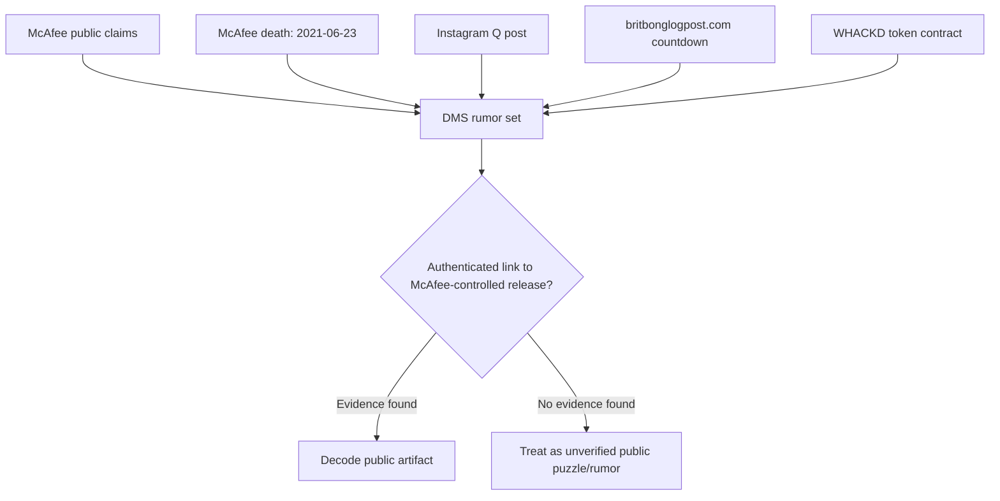
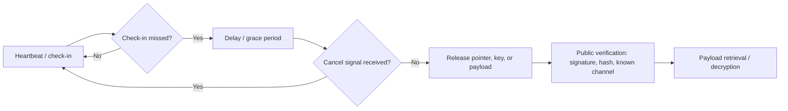
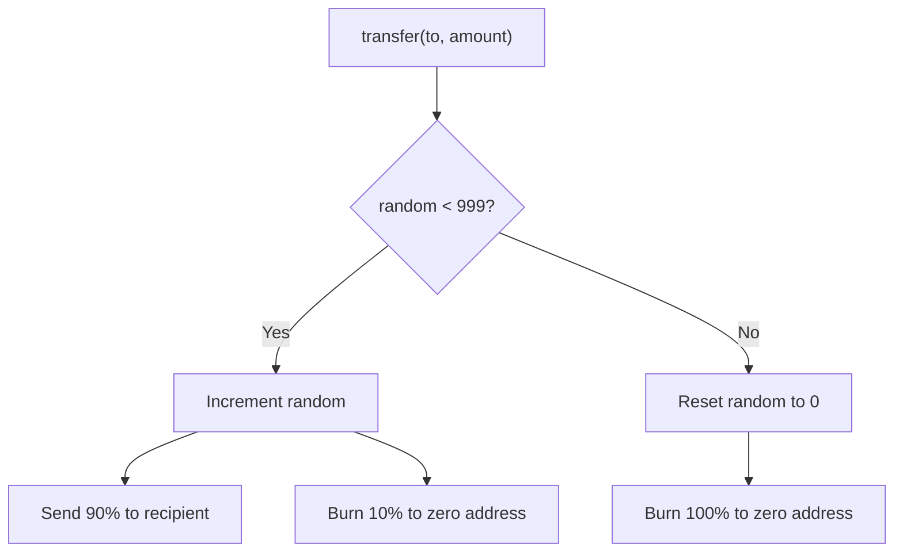
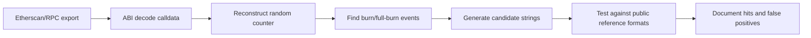
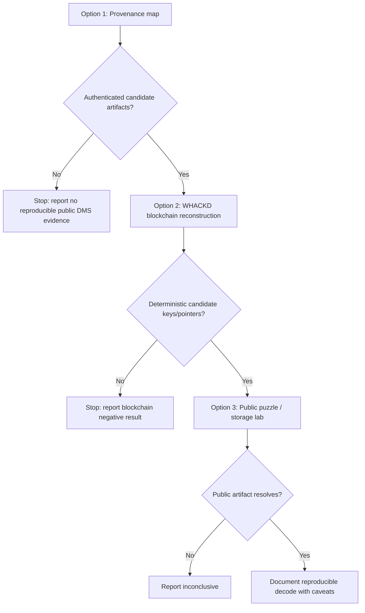

# McAfee DMS / WHACKD Report And Decoding Plan

Prepared: 2026-05-24  
Scope: public-source OSINT, public blockchain analysis, and lawful cryptographic/puzzle analysis only.

## Executive Summary

John McAfee publicly made dead-man-switch-like claims before his death. The best-cited example is his June 2019 claim that he had "31+ terabytes" of incriminating data that would be released if he was arrested or disappeared, later reported by Newsweek and PolitiFact. That claim is real as a public claim. The existence of the cache, a working switch, a release key, or a successful post-death release is not verified.

The post-death ecosystem has three main artifact families:

1. McAfee statements: public threats that data would be released, plus later "if I suicide myself..." and WHACKD tattoo statements.
2. Post-death public artifacts: the June 2021 Instagram "Q" post, Telegram/QAnon claims, and the britbonglogpost.com countdown page.
3. WHACKD token artifacts: the official 2019 Ethereum ERC-20 token at `0xCF8335727B776d190f9D15a54E6B9B9348439eEE`, whose verified contract name is `Epstein` and whose transfer logic burns 10% of ordinary transfers and burns 100% on the counter rollover.

My assessment: WHACKD is real, McAfee's DMS rhetoric is real, and the post-death rumor network is real. A McAfee-controlled operational DMS is unproven. The practical decoding plan should therefore start by proving provenance before attempting to decode payloads.

## Confidence Matrix

| Claim | Assessment | Confidence |
|---|---|---:|
| McAfee made DMS-like public claims about a data release | Verified by multiple public reports | High |
| McAfee died in Spanish custody on 2021-06-23 after extradition approval | Verified by AP/Reuters-style reporting and later Spanish court reporting | High |
| The Instagram "Q" post appeared after death reports | Reported by multiple media outlets | High |
| The "Q" post proves a DMS trigger | No public authentication | Low |
| britbonglogpost.com existed and showed a countdown tied to WHACKD | Archived/reported, RDAP creation confirmed | High |
| McAfee controlled britbonglogpost.com | No public proof; domain registered after death report | Low |
| Official WHACKD contract is `0xCF833...9eEE` and named `Epstein` | Etherscan/getwhackd/CoinMarketCap corroborate | High |
| WHACKD encodes a dead-man-switch payload | No verified payload or decoding path yet | Speculative |

## Evidence Flow

The key decision point is authentication. A public artifact can be interesting without being evidence that McAfee controlled it.

## How A Dead Man Switch Works

A dead man switch is a release system that acts when the operator stops proving they are alive or in control. In a digital context, the design usually has five layers:

1. Heartbeat: the operator periodically checks in.
2. Trigger logic: missed check-ins, death reports, custody events, or a manual signal move the switch into release mode.
3. Payload storage: the data is stored somewhere durable, often encrypted and distributed.
4. Key release: the system publishes a decryption key, coordinates, manifest, or pointer.
5. Authentication: recipients can verify that the message or key came from the operator.

For the McAfee DMS story to move from rumor to evidence, at least one of these must be proven:

- A signed message from a known McAfee key or account.
- A pre-committed hash before death and a matching payload or key after death.
- A public storage pointer whose provenance predates death and ties to McAfee.
- A reproducible decoding rule that yields non-arbitrary output and can be independently verified.

No public source found so far proves any of those.

## Public Timeline

| Date | Event | Notes |
|---|---|---|
| 2019-06-09 | McAfee claimed he had "31+ terabytes" of incriminating data and would release it if arrested or disappeared | Reported by Newsweek and PolitiFact; underlying data unverified |
| 2019-11 | McAfee promoted WHACKD, themed around "Epstein Didn't Kill Himself" | Covered by crypto press; official token later appears on-chain |
| 2019-11-16 | Official WHACKD contract creation | Etherscan shows create transaction `0x1bb323576cd7dcb12e9f8507a5e298a0136927a486f959e3984cb7cca21ed96b`, block `8943162`, 2019-11-16 07:25:23 UTC |
| 2019-11-30 | McAfee posted the "If I suicide myself..." / WHACKD tattoo message | Reported by Newsweek and other outlets |
| 2020-10-05 | DOJ announced tax-evasion indictment after McAfee arrest in Spain | Official DOJ source |
| 2021-03-05 | DOJ announced separate crypto fraud/money-laundering charges involving McAfee and Jimmy Watson | Official DOJ SDNY source |
| 2021-06-23 | McAfee found dead in Brians 2 prison after Spanish extradition approval | AP and Reuters/Euronews reporting |
| 2021-06-23/24 | Instagram "Q" post appeared after death reporting | Newsweek/Misbar; no public proof it was McAfee or an automated DMS |
| 2021-06-24 | britbonglogpost.com registered | Verisign RDAP shows registration at 2021-06-24T07:32:18Z |
| 2021-06-24 to 2021-06-28 | britbonglogpost.com countdown circulated | Bitcoin.com reported the site, WHACKD link, and countdown |
| 2021-06-25 onward | Fake Surfside/condo 31TB tweet spread | PolitiFact rated the image false |
| 2023-09-29 | Spanish court rejected appeal to reopen death investigation | AP reported authorities found nothing suggesting other than suicide |

## WHACKD Token Mechanics

Official contract:

`0xCF8335727B776d190f9D15a54E6B9B9348439eEE`

Observed facts:

- Etherscan labels the verified contract name as `Epstein`.
- getwhackd.org calls this the official WHACKD contract address.
- CoinMarketCap lists the same contract and describes the 10% burn plus full burn mechanism.
- Etherscan's contract-creation page shows one creation transaction on 2019-11-16, creating `Epstein`.
- A direct Ethereum JSON-RPC receipt lookup for creation transaction `0x1bb323576cd7dcb12e9f8507a5e298a0136927a486f959e3984cb7cca21ed96b` returns status `0x1`, `to: null`, contract address `0xcf8335727b776d190f9d15a54e6b9b9348439eee`, block `8943162`, and block timestamp `2019-11-16 07:25:23 UTC`.
- The public contract-source mirrors show an initial supply of `1,000,000,000 WHACKD` with 18 decimals.

The simplified transfer logic:

Important technical caveat: community code review in the Whackd/whackd-counter GitHub repo says the counter increments on `transfer`, not `transferFrom`. It also says if the counter is stuck at `999`, subsequent `transferFrom` calls can be fully burned until a normal `transfer` resets it. This means the public phrase "every 1000th transaction" is an oversimplification; the actual state depends on method calls and contract storage.

That matters for decoding because any theory that derives keys from "the 1000th transaction" must define whether it counts:

- all Ethereum transactions to the contract,
- ERC-20 `Transfer` logs,
- direct `transfer` calls only,
- `transferFrom` calls,
- Uniswap swaps that route through `transferFrom`,
- or the internal `random` storage state.

Without that definition, decoding attempts become arbitrary.

## Medium / Snowkid Article Assessment

The Medium article "WHACKD - Token analysis" by Snowkid is useful as community analysis, not as authoritative attribution. It claims to analyze WHACKD airdrops, liquidity, Uniswap sellers, possible airdrop farming, and major holders.

High-value items from the article:

- It treats WHACKD as McAfee's "Epstein coin."
- It gives airdrop counts and recipient counts.
- It lists Uniswap pool and liquidity-provider addresses.
- It flags possible airdrop-farming behavior.
- It labels some addresses with inferred roles, including a possible "John McAfee Token Allocation."

Caveat: address labels and motive claims in the article should be treated as hypotheses unless independently reproduced from the article's code/data and corroborated by primary sources. The article itself uses speculative language in places.

## Known False Or Weak Leads

| Lead | Status | Why it matters |
|---|---|---|
| Surfside/Champlain Towers 31TB tweet | False/fabricated per PolitiFact | Do not use as a payload-location clue |
| Instagram "Q" metadata as hidden key | Weak | Newsweek reported a counterclaim that the "code" was normal Facebook/Instagram metadata |
| britbonglogpost.com as McAfee-controlled DMS | Weak | Site existed, but RDAP creation was after death reporting and no public authentication ties it to McAfee |
| Copycat WHACKD contracts after June 2021 | High scam risk | Must separate original 2019 WHACKD from later lookalikes |
| Any decoded "31TB" claim without source hash | Weak | No known public payload, manifest, or pre-death commitment |

## Decoding Plan: Three Options / Goals

### Option 1 - Provenance Map

Goal: determine whether there is a coherent public evidence chain connecting McAfee, WHACKD, and a specific puzzle or payload.

This should be the first option because it prevents wasted effort on fake screenshots and copycat contracts.

Inputs:

- McAfee public tweets and archived posts.
- News reports and fact checks.
- WHACKD official contract, official site, and historical captures.
- britbonglogpost.com captures and RDAP records.
- Any alleged clue images, files, hashes, wallet addresses, Swarm/IPFS/Arweave references, or Telegram claims.

Method:

1. Build `sources.csv` with URL, archive URL, first-seen date, author/account, artifact type, and confidence.
2. Build a graph with nodes for claims, accounts, domains, contracts, wallets, transactions, and files.
3. Mark every edge as primary, secondary, repost, inference, or unsupported.
4. Reject any artifact that has no original source, no archive, or only screenshot provenance.
5. Produce a short list of "decode candidates" that have enough provenance to justify technical analysis.

Deliverables:

- `sources.csv`
- `evidence_graph.graphml`
- `decode_candidates.md`
- confidence-ranked timeline

Success criteria:

- Every candidate artifact has a public URL or archive.
- Every McAfee attribution has a direct source or is marked unverified.
- Known false leads are excluded.

Stop conditions:

- The lead depends on private/leaked data.
- The source chain collapses into unverifiable screenshots.
- The investigation starts identifying private individuals behind wallets without public consent or strong public-interest justification.

### Option 2 - WHACKD Blockchain Reconstruction

Goal: reconstruct the official WHACKD contract's on-chain state and transaction history to test whether a reproducible public key/message derivation exists.

This option tests the most concrete technical artifact: the official WHACKD contract.

Inputs:

- Official WHACKD contract: `0xCF8335727B776d190f9D15a54E6B9B9348439eEE`
- Creation tx: `0x1bb323576cd7dcb12e9f8507a5e298a0136927a486f959e3984cb7cca21ed96b`
- Verified ABI/source from Etherscan.
- Etherscan/Alchemy/Infura archive data.
- Snowkid/Whackd code repositories, if reproducible.

Method:

1. Export all transactions to the official contract.
2. Decode calldata into method calls: `transfer`, `transferFrom`, `approve`, and other functions.
3. Reconstruct the `random` counter from creation to selected blocks.
4. Compare reconstructed counter to storage slot reads at known blocks if archive-node access is available.
5. Identify full-burn events and distinguish direct `transfer` burns from `transferFrom` edge cases.
6. Extract deterministic candidate material from each event class:
   - tx hash,
   - block hash,
   - block timestamp,
   - sender,
   - recipient,
   - amount,
   - event index,
   - `random` value before/after.
7. Run only bounded, documented transforms: hex/ascii, keccak, SHA-256, base64/base58, ENS/IPFS/Swarm reference checks, and exact hash matching.

Deliverables:

- reproducible notebook (`whackd_reconstruction.ipynb` or `.py`)
- transaction dataset with hashes and decoded methods
- counter reconstruction table
- list of candidate references and negative results

Success criteria:

- Another analyst can rerun the notebook and reproduce the same counter and event list.
- Any decoded output resolves to a public artifact without private access.
- False positives are recorded, not hidden.

Stop conditions:

- A theory requires private keys, wallet access, credential attacks, or brute forcing encrypted private archives.
- Address attribution is unsupported.
- Output appears to expose private personal data, credentials, or keys.

### Option 3 - Public Puzzle / Swarm-IPFS Artifact Lab

Goal: test the strongest public artifacts as puzzle objects, including the theory that transaction data may derive a content-addressed pointer or feed topic.

This option should only start after Option 1 produces candidate files/strings and Option 2 produces candidate transaction-derived values.

Inputs:

- Public images, pages, files, or text from archived sources.
- Candidate strings from Option 2.
- Public decentralized-storage references: IPFS CIDs, Arweave tx IDs, Swarm references, ENS content hashes.
- Public docs for Swarm feeds and single-owner chunks.

Relevant technical background:

- Swarm stores content-addressed chunks and single-owner chunks.
- Swarm feeds can use an Ethereum owner address plus a topic to locate mutable feed updates.
- Bee/Swarm docs describe feeds as resolvable by owner and topic, with sequence or epoch-style indexing.

Method:

1. Preserve every input artifact byte-for-byte with SHA-256, source URL, archive URL, and retrieval date.
2. Run metadata and file-type checks: `exiftool`, `file`, `strings`, `binwalk`, image dimensions, color channels.
3. Test common public encodings and references:
   - IPFS CIDv0/CIDv1,
   - Swarm 32-byte reference,
   - Arweave transaction ID,
   - Ethereum address,
   - ENS name/content hash,
   - base64/base58/hex/ascii.
4. For Swarm theories, test only public retrieval:
   - owner address + topic candidates,
   - sequence/epoch indexes derived from public timestamps,
   - no private key use, no uploading, no bypassing.
5. Log every transform and output. Discard outputs that are not reproducible or are just pattern-matching noise.

Deliverables:

- `artifact_manifest.csv`
- `artifact_hashes.sha256`
- `puzzle_lab.ipynb`
- table of tested transforms and results
- final "no hit / weak hit / strong hit" assessment

Success criteria:

- Any hit resolves using public infrastructure.
- The derivation rule is simple enough to explain and reproduce.
- The result is corroborated by provenance or blockchain evidence.

Stop conditions:

- The work becomes password cracking, wallet cracking, private-account recovery, or access-control bypass.
- Output includes credentials, private keys, private personal data, or non-public files.
- The only "result" depends on subjective interpretation.

## Recommended Execution Order

Recommended priority:

1. Start with Option 1 for one workday.
2. If at least three candidate artifacts survive provenance screening, run Option 2.
3. Run Option 3 only on candidates that are public, sourceable, and reproducible.

## Practical First Milestones

Milestone 1: source control

- Create `sources.csv`.
- Capture current URLs and archive URLs.
- Add columns: `claim`, `source_type`, `first_seen`, `confidence`, `notes`.

Milestone 2: contract reconstruction

- Fetch verified ABI/source for `0xCF8335727B776d190f9D15a54E6B9B9348439eEE`.
- Export all contract transactions and token transfer logs.
- Decode method selectors.
- Reconstruct `random` counter and full-burn events.

Milestone 3: candidate extraction

- Produce deterministic candidate strings from full-burn events.
- Test for known public reference formats.
- Keep a negative-results table.

Milestone 4: artifact lab

- Analyze only artifacts with public provenance.
- Hash originals.
- Run bounded metadata/encoding/steganography checks.
- Publish reproducible notes.

## Source Appendix

- AP, "Antivirus pioneer John McAfee found dead in Spanish prison": https://apnews.com/article/john-mcafee-dead-spain-prison-extradition-c39cc0f375a975946fb83b60cc2bf3d3
- AP, "A Spanish court rejects appeal to reopen the investigation into tycoon John McAfee's jail cell death": https://apnews.com/article/spain-mcafee-death-suicide-court-38bf1fd5725fc0548a9aac6ac1bd0fd0
- Euronews/Reuters, autopsy reporting: https://www.euronews.com/2021/06/28/us-spain-usa-mcafee
- Newsweek, "John McAfee 'Q' Instagram Post Sparks Dead Man's Switch Conspiracy": https://www.newsweek.com/john-mcafee-suicide-q-instagram-dead-mans-switch-1603638
- Misbar, "McAfee's Q Post: Hack or Hoax?": https://www.misbar.com/amp/en/editorial/2021/06/29/mcafee%E2%80%99s-q-post-hack-or-hoax
- DOJ, "John McAfee Indicted for Tax Evasion": https://www.justice.gov/archives/opa/pr/john-mcafee-indicted-tax-evasion
- DOJ SDNY, "John David McAfee And Executive Adviser... Indicted...": https://www.justice.gov/usao-sdny/pr/john-david-mcafee-and-executive-adviser-his-cryptocurrency-team-indicted-manhattan
- Official WHACKD site: https://getwhackd.org/
- CoinMarketCap WHACKD page: https://coinmarketcap.com/currencies/whackd/
- Etherscan official WHACKD token: https://etherscan.io/token/0xcf8335727b776d190f9d15a54e6b9b9348439eee
- Etherscan WHACKD contract creation transaction: https://etherscan.io/tx/0x1bb323576cd7dcb12e9f8507a5e298a0136927a486f959e3984cb7cca21ed96b
- Snowkid, "WHACKD - Token analysis": https://snowkidind.medium.com/whackd-token-analysis-223fa0843f74
- Whackd/whackd-counter GitHub repo: https://github.com/Whackd/whackd-counter/
- Bitcoin.com News, britbonglogpost/WHACKD coverage: https://news.bitcoin.com/mysterious-john-mcafee-website-appears-for-two-days-whackd-token-climbs-over-700/
- Verisign RDAP for britbonglogpost.com: https://rdap.verisign.com/com/v1/domain/britbonglogpost.com
- PolitiFact, fake Surfside/31TB tweet: https://www.politifact.com/factchecks/2021/jun/28/instagram-posts/image-suggesting-john-mcafee-stored-files-collapse/
- Swarm docs, chunk types: https://docs.ethswarm.org/docs/develop/tools-and-features/chunk-types/
- Swarm docs, feeds: https://docs.ethswarm.org/docs/develop/tools-and-features/feeds/
- Bee JS docs, SOC and feeds: https://bee-js.ethswarm.org/docs/soc-and-feeds/
